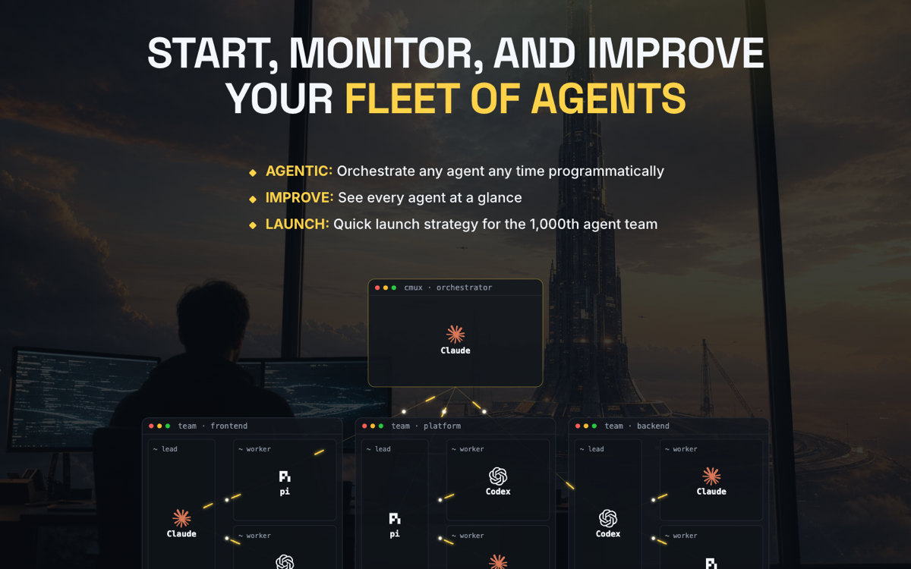

# cmux — Orchestrate Agents

Visual guide to orchestrating coding agents with cmux: tiers, the agentic loop, and multi-agent access.

[{ loading=lazy }](/pages/cmux-guide/index.html)

[Open the document →](/pages/cmux-guide/index.html){ .md-button .md-button--primary }

**Source:** [IndyDevDan (YouTube)](https://www.youtube.com/@indydevdan) · [disler/learning-cmux-with-agents (GitHub)](https://github.com/disler/learning-cmux-with-agents)
