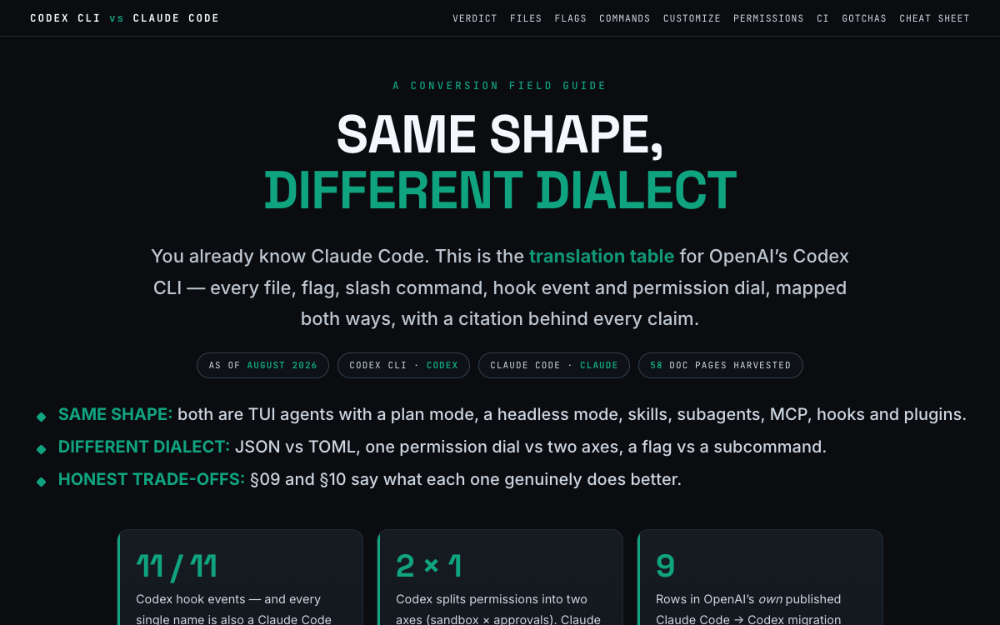

# Codex CLI vs Claude Code

Side-by-side field guide: shared mental model, conversion tables (CLAUDE.md ↔ AGENTS.md, settings.json ↔ config.toml, flags, slash commands, hooks, skills, MCP), the sandbox/approval model, codex exec and CI, and each agent's exclusive features.

[{ loading=lazy }](/pages/codex-cli-vs-claude-code/index.html)

[Open the document →](/pages/codex-cli-vs-claude-code/index.html){ .md-button .md-button--primary }

**Source:** OpenAI Codex Docs + Claude Code Docs, August 2026
