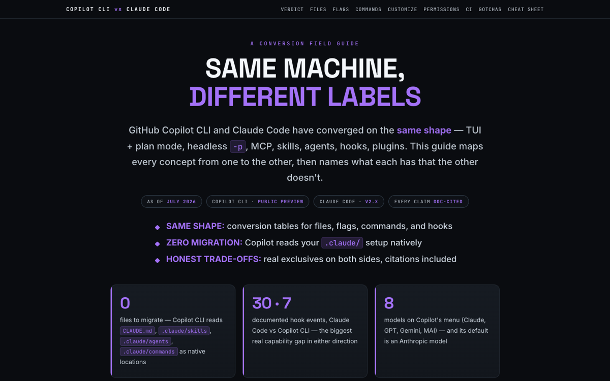

# Copilot CLI vs Claude Code

Side-by-side field guide: shared mental model, conversion tables (CLAUDE.md ↔ AGENTS.md, flags, hooks, skills, MCP), permissions, CI/Actions, and each agent's exclusive features.

[{ loading=lazy }](/pages/copilot-cli-vs-claude-code/index.html)

[Open the document →](/pages/copilot-cli-vs-claude-code/index.html){ .md-button .md-button--primary }

**Source:** [GitHub Docs · Copilot CLI](https://docs.github.com/en/copilot/how-tos/copilot-cli) + [Claude Code Docs](https://code.claude.com/docs/en/overview), July 2026
