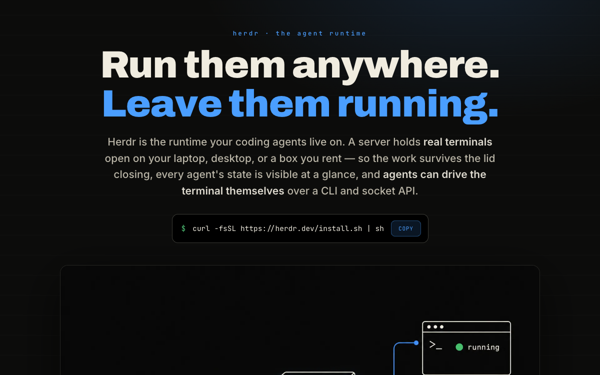

# Herdr — Run Them Anywhere, Leave Them Running

Visual field guide to Herdr, the runtime coding agents run on: mental model, control loop, agent
states, 30 orchestration prompts, socket API, keyboard, integrations, and how it compares to tmux,
cmux and Warp.

[{ loading=lazy }](/pages/herdr-guide/index.html)

[Open the document →](/pages/herdr-guide/index.html){ .md-button .md-button--primary }

**Source:** [herdr.dev](https://herdr.dev) · [herdr.dev/docs](https://herdr.dev/docs/) · [herdrdev/herdr (GitHub)](https://github.com/herdrdev/herdr)
