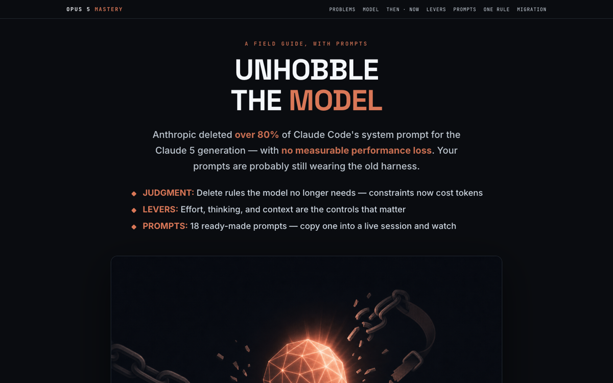

# Opus 5 Mastery — Unhobble the Model

A field guide to getting the best out of Claude Opus 5: delete Claude-4-era constraints, pull the effort/thinking/context levers, and paste 18 ready-made prompts to see every lesson in a live session.

[{ loading=lazy }](/pages/opus-5-mastery/index.html)

[Open the document →](/pages/opus-5-mastery/index.html){ .md-button .md-button--primary }

**Source:** Anthropic: Prompting Claude Opus 5 + The New Rules of Context Engineering
