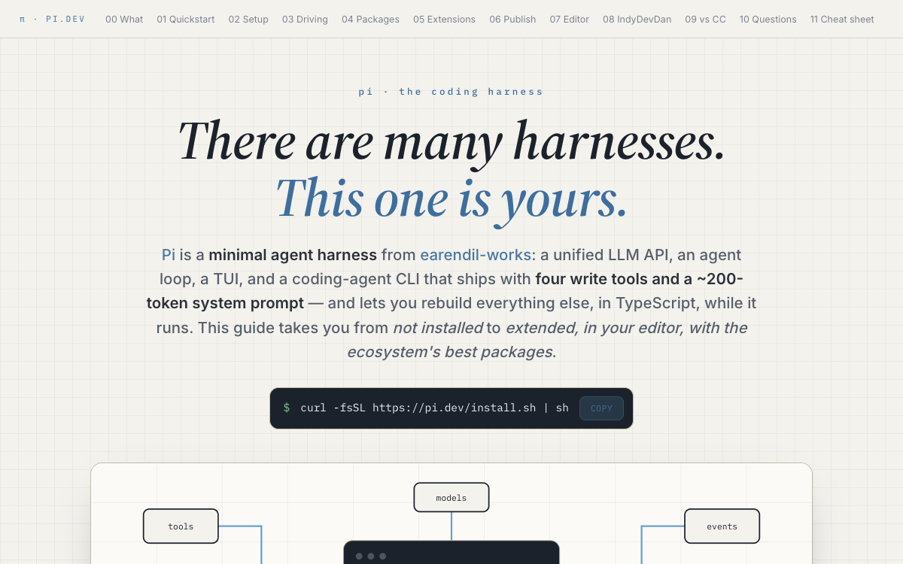

# Pi — The Coding Harness

Field guide to Pi (pi.dev), the minimal programmable coding harness: quickstart, recommended setup, extensions in TypeScript, VS Code/Cursor config, 12 ecosystem packages, and IndyDevDan's Pi work.

[{ loading=lazy }](/pages/pi-harness-guide/index.html)

[Open the document →](/pages/pi-harness-guide/index.html){ .md-button .md-button--primary }

**Source:** pi.dev docs + earendil-works/pi + disler repos, August 2026
