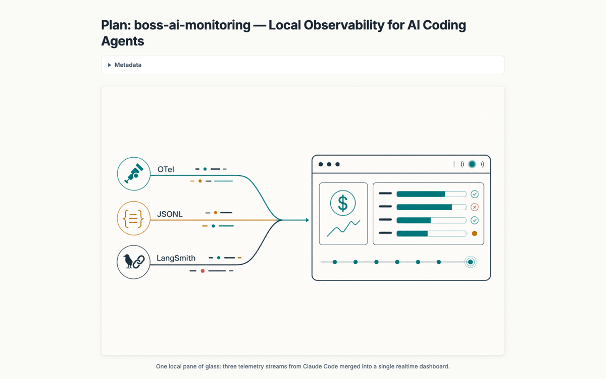

# boss-ai-monitoring — Local Observability for AI Coding Agents

Plan for local observability of AI coding agents: storage pipeline, dashboards, and agent-loop instrumentation.

[{ loading=lazy }](/pages/boss-ai-monitoring/boss-ai-monitoring.html)

[Open the document →](/pages/boss-ai-monitoring/boss-ai-monitoring.html){ .md-button .md-button--primary }

**Source:** bossjones/boss-skills
